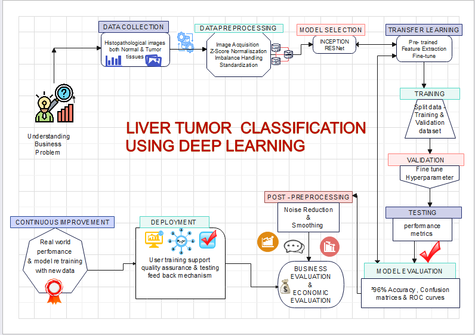

<h1>Data Science Projects</h1>

# Project 01 : Medical Inventory Optimization & Forecasting

**Project Description:**
This project focuses on addressing the notable surge in bounce rates within the healthcare system, adversely affecting patient satisfaction. The aim is to optimize medical inventory levels to minimize bounce rates while keeping inventory costs at a minimum.

**Key Features:**

* **Data Preprocessing:** Explore and preprocess historical data to ensure accuracy in forecasting.

* **SARIMAX Model Implementation:** Implement SARIMAX models for future bounce rate predictions.

* **Streamlit Model Deployment:** Utilize Streamlit for real-time processing and transparent display of forecasted values and dates.

* **Data Visualization:** Enhance comprehension with line charts and histograms to facilitate effective decision-making.

* **Continuous Monitoring:** Ensure continuous monitoring and feedback for iterative improvements and validation of strategies.

**Objective:**
The primary objective of this project is to achieve a minimum 30% reduction in bounce rates and drive a revenue increase of at least 20 lacs INR through effective inventory optimization.

**Project Scope:**

* Analyze historical bounce rates and key contributing factors.

* Explore and preprocess relevant data for accurate forecasting.

* Implement SARIMAX models for future bounce rate predictions.

* Optimize inventory levels to align with forecasted demand.

* Enhance patient experience through streamlined operations.

**Conclusion:**
The forecasted values provide promising insights into the effectiveness of the implemented strategies in minimizing bounce rates and optimizing inventory costs. Continuous monitoring and assessment will be crucial to validate the actual impact on bounce rates and economic success. Further data analysis and stakeholder feedback will enhance the depth of our understanding and validate the success of the implemented strategies.

# Project 02 : Liver Tumor classification using Deep Learning
<h2>Contents:</h2>

* Business Problem
* Project Overview and Scope
* Data Collection & Data Preprocessing
* Data Spliting
* Project Architecture
* Model Building
* Model Deployment strategy
* Final Output
* Conclusion
* Challenges
* Future Work

 <h3>Business Problem:</h3>
  <ul>
    <li><h4>Business Problem:</h4> Bounce rate is increasing significantly leading to patient dissatisfaction.</li>
    <li><h4>Business Objective:</h4> Minimize bounce rate </li>
    <li><h4>Business Constraint:</h4> Minimize inventory cost</li>
    <li><h4>Success Criteria:</h4>
    <li><h5> Business Success Criteria:</h5>Reduce bounce rate by at least 30%</li>
    <li><h5>Economic Success Criteria</h5>Increase revenue by at least 20 lacs INR by reducing bounce rate</li>
  </ul>

<h3>Project Overview and Scope</h3>
<h4>Project Goals and Objectives:</h4>
<ul>
 <li>Develop a deep Learning model for liver tumor classification.</li>
 <li>Minimize Bounce rate in medical diagnosis by improving accuracy and efficiency.</li>
 <li>Enhance Patient Satisfaction through accurate and timely diagnosis.</li>
</ul>

<h4>Scope of the Project:</h4>
<ul>
 <li>Utilize deep learning techniques to analyze medical images for liver tumor detection.</li>
 <li>Implement data preprocessing,model building and deployment phases.</li>
 <li>Evaluate model performance on reducing bounce rate and improving patient outcomes.</li>
 <li>Address the business problem by providing a scalable solution for accurate tumor classification.</li>
 <li>Collaborate with medical professionals to ensure clinical relevance and effectiveness of the model.</li>
</ul>

<h3>Data Collection & Data Preprocessing:</h3>
<ul>
 <li>The Data was collected from the primary source: Directly Received from the Client. DataSet was Histopathological images of Liver tumors and Normal liver.</li>
</ul>

<h4>Data Preprocessing:</h4>
<h5>Techniques Used for Data Cleaning and Augmentation:</h5>
<ul>
 <li>Removal of irrelevant or noisy data points.</li>
 <li>Standardization of image sizes and resolutions.</li>
 <li>Augmentation techniques such as rotation, flipping and zooming to increase dataset diversity.</li>
</ul>

<h5>Importance of Data Preprocessing for Model Training:</h5>
<ul>
<li>Enhances model generalization by reducing overfitting.</li>
<li>Improves Model robustness to variations in input data.</li>
<li>Ensures quality and consistency of input data for reliable model predictions.</li>
</ul>

<h4>Data Splitting</h4>
<h5>Explanation of Data split into Training and Testing Sets:</h5>
<ul>
 <li>Divide the dataset into two subsets: Training and Testing</li>
 <li>Training set: Used to train the deep learning model.</li>
 <li>Testing Set: Used to Evaluate the Model's Performance on unseen data.</li>
</ul>

<h5>Ensuring Model Generalization with Proper Data Splitting:</h5>
<ul>
 <li>Random selection ensures representative samples in both sets.</li>
 <li>Typically a split of 70-80% for training and 20-30% for testing is used.</li>
 <li>Helps assess how well the model will perform on new, unseen data.</li>
 <li>Prevents over fitting by validating model performance on independent data.</li>
</ul>

<h4>Project Architecture</h4>
 

<h4>Model Building:</h4>

<h5>Description of Attempted Models:</h5>
<ul>
 <li>DenseNet121 , ResNet50 , ResNet152, CNN , Vgg16, Yolov8</li>
 <li>Each model has its unique architecture and capabilities.</li>
 <li>Tried various models to determine the most suitable for live tumor classification.</li>
</ul>

<h5>Selection Criteria and Rationale for Choosing  ResNet50:</h5>
<ul>
 <li>ResNet50 demonstrated a balance between accuracy and computational efficiency.</li> 
 <li>Known for its deep architecture and skip connections, allowing for effective feature extraction.</li> 
 <li>Widely used and well documented, making it easier for implementation and troubleshooting.</li>
 <li>Achieved satisfactory performance during preliminary testing.</li>
</ul>

<h4>ResNet50 Model:</h4>
<h5>Detailed Architecture of ResNet50:</h5>
<ul>
 <li>Deep Neural Network:  ResNet50 Comprises 50 layers, allowing for deep learning capabilities</li>
 <li>Skip Connections: If employs skip connections to alleviate the vanishing gradient problem, facilitating the training of deeper networks.</li>
 <li>Residual Blocks: Built using residual blocks that add the input to the output, enabling the learning of residual functions.</li>
 <li>Bottleneck Layers: Utilizes bottleneck layers  to reduce computational complexity while maintaining model depth, enhancing efficiency.</li>
</ul>

<h4>Training Process and Achieved Accuracy (96.5%)</h4>
<h5>Training Process:</h5> 
<ul>
 <li>Data Preprocessing:The dataset underwent preprocessing steps such as resizing , normalization and augmentation to enhance model performance and generalization.</li>

 <li>Hyperparameter Tuning: Hyperparameters like learning rate, batch size and optimizer choice were tuned to optimize model convergence and accuracy. </li>

 <li>Optimization techniques: Techniques like Stochastic gradient Descent (SGD), Adam , pr RMSprop were utilized to minimize the loss function during training</li>
 </ul>
<h5>Achieved Accuracy:</h5> 
<ul>
<li>After training on the preprocessed dataset, the ResNet50 model achieved an accuracy of 96.5% on the testing dataset.</li>
<li>This high accuracy demonstrates the effectiveness of the model in accurately classifying liver tumors, thereby contributing to the projects objectives of reducing bounce rates and improving patient satisfaction in medical diagnosis</li>
</ul>

<h4>Deployment</h4>
<h5>Deployment of ResNet50 using Flask:</h5> 
<ul>
<li>Flask Framework: Utilized Flask, A lightweight web framework for deploying the ResNet50 model.</li>
</ul>

<h5>Steps Involved:</h5>
<ul>
<li>Integration: Incorporate the trained ResNet50 model into a Flask web application</li>
<li>Endpoint Creation: define endpoints to receive image data for classification</li>
<li>Prediction: Implement logic to process incoming data and generate predictions using the ResNet50 Model.</li>
<li>Response Handling: Send classification results back to the user interface for display.</li>
</ul>

<h4>Conclusion</h4>
<h5>Summary of Project Outcomes and impact on Business objectives</h5> 

* The Project Successfully deployed the ResNet50 model for liver tumor classification , aligning with the objective of minimizing bounce rates in medical diagnosis.
By accurately identifying liver tumors the model contributes to improved patient satisfaction and healthcare outcomes.

<h5>Importance of Deep Learning in medical Diagnostics:</h5>

 * Deep Learning techniques, exemplified by ResNet50 ,play a pivotal role in medical diagnostics.
 * They enable precise analysis of medical images, enhancing diagnostic accuracy and facilitating timely treatment decisions.

 <h4>Challenges</h4>
<h5>Challenges Encountered During Project Implementation:</h5> 

 * Data preprocessing complexities, including normalization and augmentation posed initial challenges.
 * Optimizing hyper parameters and managing computational resources were key hurdles during model training.

<h5>Strategies Employed to Address challenges and Ensure Success:</h5> 

* Collaboration with domain experts helped refine preprocessing techniques and ensure clinical relevance.
* Fine-tuning hyper parameters and utilizing cloud computing resources addressed computational constraints leading to successful model training and deployment

<h4>Future Work</h4>
<h5>Potential Advancements in Deep Learning for medical image Analysis:</h5> 

* Emerging trends like multi-modal fusion and transfer learning hold promise for advancing medical image analysis.
* Continued research in areas like explainable AI and uncertainity estimation can further enhance the reliability and interpretability of deep learning models in medical diagnostics.
